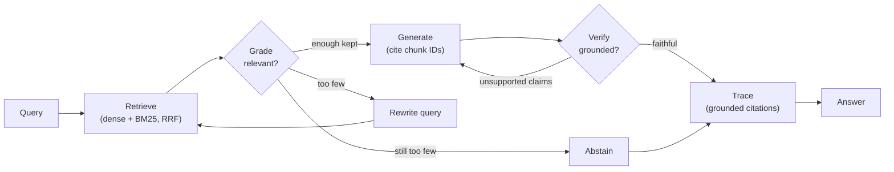
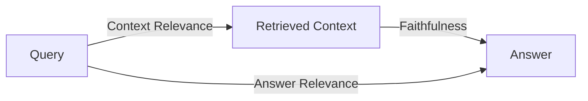

# Reliable RAG + RAGAS — over the cnWave docs

> Two LinkedIn posts, turned into working, well-commented code:
> a **Reliable RAG** pipeline with **Grade / Verify / Trace** gates, and a
> **reference-free RAGAS** evaluation triad — built over **cnWave 60 GHz
> wireless-mesh** documentation, a domain where a wrong answer has real
> consequences.

Built with **LangGraph + Claude** (`claude-opus-4-8` as judge, `claude-sonnet-4-6`
for generation/grading) and **OpenAI** embeddings, with **Chroma + BM25** hybrid
retrieval. Designed to be read top-to-bottom as a tutorial — start with
[LEARN.md](LEARN.md).

---

## Why this exists

The vanilla pipeline — `Query → Retrieve → Generate → Answer` — has **no
checkpoints**. When it returns a wrong answer you can't tell *where* it broke:
bad retrieval? irrelevant context? hallucination? Reliable RAG adds three
diagnostic gates so every failure is localisable, and RAGAS measures the whole
pipeline so you can improve what you can see.

| | Reliable RAG (runtime) | RAGAS (offline eval) |
|---|---|---|
| **Problem** | A wrong answer is undebuggable | "How good is my RAG?" without a golden set |
| **Idea** | **Grade** chunks → **Generate** → **Verify** grounding → **Trace** real citations | LLM-as-judge triad: **Context Relevance**, **Faithfulness**, **Answer Relevance** |
| **Here** | A LangGraph pipeline that abstains rather than guesses | A reference-free scorecard + dashboard |

---

## The gated pipeline



- **Grade** (`src/reliable_rag/gates/grade.py`) — Sonnet scores each retrieved
  chunk; only chunks above `GRADE_THRESHOLD` survive. Irrelevant context can't
  poison generation.
- **Generate** (`gates/generate.py`) — Sonnet answers using *only* kept chunks, in
  clean prose (sources are tracked separately by Verify/Trace, not inline).
- **Verify** (`gates/verify.py`) — Opus (the strong judge) decomposes the answer
  into claims and checks each against the context; unsupported claims trigger
  one regenerate.
- **Trace** (`trace.py`) — citations are assembled by the **pipeline** from the
  chunks the Verify gate confirmed support the answer, resolved against the store.
  A citation can't point
  to a nonexistent source — unlike a model told to "always cite your sources."
- **Abstain** — if too few chunks pass Grade (even after one query rewrite), the
  pipeline says it doesn't know instead of hallucinating.

## The RAGAS triad (offline)



Each relationship is scored by an LLM judge, **no golden answers required**:
`LLMContextPrecisionWithoutReference`, `Faithfulness` (Opus), `ResponseRelevancy`.
See `src/reliable_rag/evaluate.py`.

---

## Quickstart

```bash
python -m venv .venv
.venv\Scripts\activate            # Windows  (source .venv/bin/activate on macOS/Linux)
pip install -e ".[all]"            # core + Chainlit + Streamlit + tracing + pytest
copy .env.example .env             # then add ANTHROPIC_API_KEY + OPENAI_API_KEY
```

```bash
reliable-rag ingest                      # build the Chroma index + chunk manifest
reliable-rag ask "How do I recover an onboard E2E node?"
reliable-rag eval                        # RAGAS scorecard -> eval/results/
chainlit run app/chainlit_app.py         # gated-chat demo (gates as live steps)
streamlit run app/streamlit_dashboard.py # RAGAS dashboard + human feedback
```

> **Keys:** Claude powers generation + the gates + the RAGAS judge; OpenAI powers
> *only* the embeddings (Anthropic has no embeddings API). Tests and the chunkers
> run with no keys at all.

### Install subsets

The two UIs and the trace explorers are optional extras, so the core installs
cleanly on its own:

```bash
pip install -r requirements.txt     # core only (ingest / ask / eval)
pip install -e ".[chat]"            # + Chainlit
pip install -e ".[dashboard]"       # + Streamlit
pip install -e ".[tracing]"         # + local Phoenix UI / LangSmith
pip install -e ".[dev]"             # + pytest
```

---

## CLI

| Command | What it does |
|---|---|
| `reliable-rag ingest` | Chunk `DOCS_DIR`, build the Chroma index, write `chunks.jsonl` |
| `reliable-rag ask "<q>"` | Run the gated pipeline; print the answer + gate trace + citations + cost |
| `reliable-rag eval` | Run the RAGAS triad over `eval/questions.yaml` → scorecard |
| `reliable-rag gen-testset` | (Optional) synthesise a question set from the docs |

---

## Count the cost + observability

Reliable RAG trades extra LLM calls for safety — so we **measure** that trade.

- **Cost** (`cost.py`): every answer reports a per-gate token + dollar breakdown
  (Opus $5/$25, Sonnet $3/$15, Haiku $1/$5 per 1M; OpenAI embeddings ≈$0.02/1M).
  Token counts come free off each response's `usage_metadata` — no extra calls.
  **Ingestion** tracks its own embedding spend (exact token counts via `tiktoken`)
  and appends each run to a timestamped log at `runs/ingest_cost.jsonl`.
- **Trace log** (`observability.py`): every query writes `runs/<id>.json` with the
  retrieved chunks + scores, the Grade decisions, the answer, Verify's per-claim
  grounding, flags, and per-gate latency. Open it to see exactly what happened.
- **Optional trace UI**: `TRACING=phoenix` (local, open-source) or `langsmith`
  (hosted) lights up a span-waterfall of the whole run. Off by default.
- **Human feedback**: the Chainlit demo logs 👍/👎 to `feedback/`, surfaced in the
  Streamlit dashboard beside the automated RAGAS scores.

---

## Repository layout

```
src/reliable_rag/
  config.py        settings (one place for every knob)
  schemas.py       data shapes + the LangGraph state
  models.py        Claude + OpenAI client factories
  chunkers/        markdown_header_chunker.py
  ingest.py        chunk -> Chroma index + chunk manifest
  retrieval.py     hybrid dense + BM25 (RRF) retriever
  gates/           grade.py · generate.py · verify.py
  graph.py         the LangGraph StateGraph (gates + conditional edges)
  trace.py         grounded-citation assembly
  cost.py          per-gate token + $ accounting
  observability.py run logs · rich console · optional Phoenix/LangSmith
  feedback.py      👍/👎 store
  condense.py      conversational follow-up -> standalone query (optional)
  pipeline.py      run_query() — the one entrypoint
  cli.py           ingest / ask / eval / gen-testset
eval/   questions.yaml · run_ragas.py · testset_gen.py
app/    chainlit_app.py · streamlit_dashboard.py
tests/  offline tests (chunkers, gates, graph) — no API keys needed
docs/   the cnWave corpus (the demo dataset)
```

See [LEARN.md](LEARN.md) for the guided tour, [CHUNKING.md](CHUNKING.md) for why
the chunking is structure-aware, and [LIBRARIES.md](LIBRARIES.md) for the third-party
library calls used — what each does, why, key parameters, and the gotchas.

---

## Limitations (honest notes)

- **LLM-as-judge isn't perfect** — both Verify and RAGAS can mis-grade subtle
  cases; that's why Verify uses the strongest model and the eval is reproducible.
- **Cost/latency** — the gates add ~3–4 LLM calls per query vs. 1 for vanilla RAG.
  Knobs: `ENABLE_VERIFY=false`, batched grading (default), or Haiku for Grade.
- **Embedding cost is estimated** (the embeddings client doesn't surface token
  usage); it's tiny per query and clearly labeled.

## Credits

- *RAG Made Simple* by **Nir Diamant** — the "Reliable RAG" concept and contextual
  chunk headers.
- **RAGAS** (`explodinggradients/ragas`) — the reference-free evaluation triad.
- Corpus: cnWave 60 GHz wireless-mesh documentation.

## License

MIT — see [LICENSE](LICENSE).
